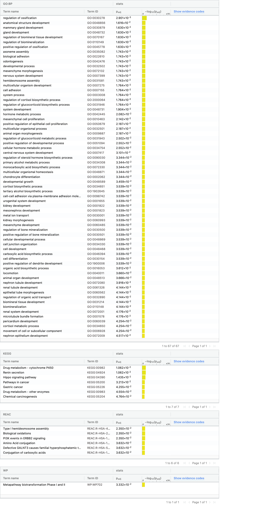

```{r setup, echo=FALSE, message=FALSE}

if (!requireNamespace("BiocManager", quietly = TRUE))    
  install.packages("BiocManager")

if (!requireNamespace("GEOmetadb", quietly = TRUE))    
  BiocManager::install("GEOmetadb")

if (!requireNamespace("biomaRt", quietly = TRUE))
  BiocManager::install("biomaRt")

if (!requireNamespace("ComplexHeatmap", quietly = TRUE))
  BiocManager::install("ComplexHeatmap")

if (!requireNamespace("DBI", quietly = TRUE))
  install.packages("DBI")

if (!requireNamespace("dplyr", quietly = TRUE))
  install.packages("dplyr")

if (!requireNamespace("edgeR", quietly = TRUE))
  install.packages("edgeR")

if (!requireNamespace("limma", quietly = TRUE))
  install.packages("limma")

if (!requireNamespace("ggplot2", quietly = TRUE))
  install.packages("ggplot2")

if (!requireNamespace("tidyr", quietly = TRUE))
  install.packages("tidyr")

if (!requireNamespace("cowplot", quietly = TRUE))
  install.packages("cowplot")

if (!requireNamespace("circlize", quietly = TRUE))
  install.packages("circlize")

if (!requireNamespace("knitr", quietly = TRUE))
  install.packages("knitr")

library("dplyr")

```

# Introduction

## Preperations

```{r loading, warning=FALSE, message=FALSE, tidy=TRUE}

if (!file.exists("GEO_data_cleaned.rds")) {
  options(knitr.duplicate.label = 'allow')
  source(knitr::purl("A1_SijieXu.Rmd", output = tempfile()))
}

geo_data <- readRDS("GEO_data_cleaned.rds")

# Map sample matrix
samples <- data.frame(lapply(colnames(geo_data), FUN=function(x){unlist(strsplit(x, split = "_"))}))
colnames(samples) <- colnames(geo_data)
rownames(samples) <- c("cell_type","sample_type", "patient")
samples <- data.frame(t(samples))

```

## Data visualization


The image above shows an abstraction of the data used in our analysis. RNAseq data were sampled from the patient with breast cancer, including tumor, normal breast parenchyma (NBP) and blood samples. Our study only focuses on the released tumor and NBP samples from the Illumina HiSeq 2500 platform.  

```{r plots, message=FALSE, tidy=TRUE}

# Unpivot dataset
geo_data_normalized_unpivot <- geo_data %>% 
  log2() %>% 
  as.data.frame() %>% 
  tidyr::gather(key=sample, value=log_cpm) %>% subset(log_cpm > 0)

# Density plot before and after nor.
ggplot2::ggplot(geo_data_normalized_unpivot, ggplot2::aes(x=log_cpm, color=sample)) +
  ggplot2::geom_density() + ggplot2::labs(title = "Density by sample after Normalization") + 
  ggplot2::theme(legend.position="none")

# Boxplot before and after nor.
ggplot2::ggplot(geo_data_normalized_unpivot, ggplot2::aes(x=sample, y=log_cpm, color=sample)) + 
  ggplot2::geom_boxplot() + ggplot2::coord_flip() + ggplot2::labs(title = "Boxplot by sample after Normalization") + 
  ggplot2::theme(legend.position="none")


```
The data were normalized with the TTM workflow. The first plot is a density plot after normalization; it shows an approximately bimodal distribution for our dataset. The second plot is a boxplot of the data by the sample after the normalization; it shows that the data is skewed left. 

```{r heatmap, warning=FALSE, message=FALSE, tidy=TRUE}

# Create heatmap from cleaned data
heatmap_matrix <- geo_data %>% as.matrix() %>% t() %>% scale() %>% t() %>% na.omit()
heatmap_col = circlize::colorRamp2(c(min(heatmap_matrix), 0,           
                             max(heatmap_matrix)), c("blue", "white", "red"))  

overall_heatmap <- ComplexHeatmap::Heatmap(as.matrix(heatmap_matrix),      
                           show_row_dend = TRUE,show_column_dend = TRUE,       
                           col=heatmap_col,show_column_names = TRUE,       
                           show_row_names = FALSE,show_heatmap_legend = TRUE)

# Plot the overall heatmap (output suspressed since it takes too long to run)
# overall_heatmap

```


The heatmap shows quite a few gene expression variations between different patients and sample types. Thus we should process with differential gene expression analysis. 

```{r MDS, warning=FALSE, tidy=TRUE}

# Label the MDS plots by patient 
limma::plotMDS(geo_data, 
        labels=samples$patient, 
        col = unlist(rainbow(10))[factor(samples$patient)],
        main = "MDS plot by patient")

# Label the MDS plots by samples type
limma::plotMDS(geo_data, 
        labels=samples$sample_type, 
        col = c("red", "dark green")[factor(samples$sample_type)],
        main = "MDS plot by sample type")
```

The variation between each sample type and patient is examined using MDS plot; we can see that the clustering between the same patient is closer than the clustering of the sample type. Therefore, we should be aware of possible false-positive results that are introduced by the patient variation. 

# Differential gene expression

## Model creation

```{r model, warning=FALSE, tidy=TRUE}

# Setup the model attributesf for EdgeR
model_design <- model.matrix(~ samples$sample_type)
d <- edgeR::DGEList(counts=geo_data, group=samples$sample_type)
d <- edgeR::estimateDisp(d, model_design)

# Fit QLF model and get result
fit <- edgeR::glmQLFit(d, model_design)
fit.qlf <- edgeR::glmQLFTest(fit, coef='samples$sample_typetumor')

knitr::kable(edgeR::topTags(fit.qlf), type="html",row.names = FALSE, caption = "Fitted with sample type by edgeR")

topfit_byS.qlf <- edgeR::topTags(fit.qlf,sort.by = "PValue",
                           n = nrow(geo_data))

topfit_byS.qlf_sig <- length(which(topfit_byS.qlf$table$PValue < 0.01))
topfit_byS.qlf_sigadj <- length(which(topfit_byS.qlf$table$FDR < 0.05))

# ------------------------------------------------------------------------------------------------

# Design differential expression model according to sample type for limma
model_design <- model.matrix(~ samples$sample_type)
minimalSet <- Biobase::ExpressionSet(heatmap_matrix)

fit <- limma::lmFit(minimalSet, model_design) %>% limma::eBayes(trend=TRUE)

topfit <- limma::topTable(fit,                    
                   coef=ncol(model_design),                   
                   adjust.method = "BH",                   
                   number = nrow(geo_data))

topfit$hgnc_symbol <- rownames(topfit)

# Sort by pvalue
topfit_byS <- topfit[order(topfit$adj.P.Val),]

# Showcase data
knitr::kable(topfit[1:10,],type="html",row.names = FALSE, caption = "Fitted with sample type by limma")

topfit_byS_sig <- length(which(topfit_byS$P.Value < 0.01))
topfit_byS_sigadj <- length(which(topfit_byS$adj.P.Val < 0.05))

# ------------------------------------------------------------------------------------------------

# Design differential expression model according to cell type + patient
model_design <- model.matrix(~ samples$sample_type + samples$patient)
minimalSet <- Biobase::ExpressionSet(heatmap_matrix)

fit <- limma::lmFit(minimalSet, model_design) %>% limma::eBayes(trend=TRUE)

topfit <- limma::topTable(fit,                    
                   coef=ncol(model_design),                   
                   adjust.method = "BH",                   
                   number = nrow(geo_data))

topfit$hgnc_symbol <- rownames(topfit)

# Sort by pvalue
topfit_bySP <- topfit[order(topfit$adj.P.Val),]

# Showcase data
knitr::kable(topfit[1:10,],type="html",row.names = FALSE, caption = "Fitted with sample type & patient by limma")

topfit_bySP_sig <- length(which(topfit_bySP$P.Value < 0.01))
topfit_bySP_sigadj <- length(which(topfit_bySP$adj.P.Val < 0.05))

```

#### 1. Calculate p-values for each of the genes in your expression set. 
How many genes were significantly differentially expressed? What thresholds did you use and why?

Here we calculate p-values for each of the genes in the expression set. The thresholds of 1% are chosen because our data set is consists of> 20,000 genes. If 1% of these are included by random chance, there will be around 200 false positives, which is not ideal for the downstream threshold over-representation analysis. However, I choose to use 5% for the adjusted P-value since it is usually enough for RNA-seq analysis.  

The simple model (model using sample along by limma) labels `r topfit_byS_sig` genes with significant p values from the analysis above. In the meantime, there are `r topfit_bySP_sig` genes with significant p values in the complex model (using sample + patient by limma). Additionally, the simple model by edgeR produces `r topfit_byS.qlf_sig` genes with significant p values.

#### 2. Multiple hypothesis testing - correct your p-values using multiple hypothesis correction methods. 
Which method did you use? And Why? How many genes passed correction?

I choose to go with empirical Bayes moderation in the limma package and quasi-likelihood negative binomial generalized log-linear model for multiple hypothesis correction. 

The simple model (model using sample along by limma) labels `r topfit_byS_sigadj` genes with significant adjusted p values from the analysis above. In the meantime, there are `r topfit_bySP_sigadj` genes with significant adjusted p values in the complex model (using sample + patient by limma). Additionally, the simple model by edgeR produces `r topfit_byS.qlf_sigadj` genes with significant adjusted p values.

Eventually, I decided to use the QLF method based on the observation below:

## Model selection

### Simple versus complex (Limma)

```{r model_comparison_by_complexity, warning=FALSE, tidy=TRUE}
# Model comparison
simple_model_pvalues <- data.frame(hgnc_symbol =  
                                     topfit_byS$hgnc_symbol,  
                                   simple_pvalue=topfit_byS$P.Value)

pat_model_pvalues <-  data.frame(hgnc_symbol =  
                                   topfit_bySP$hgnc_symbol,  
                                 patient_pvalue = topfit_bySP$P.Value)

two_models_pvalues <- merge(simple_model_pvalues,  pat_model_pvalues,by.x=1,by.y=1)

# Plot across simple & complex model
two_models_pvalues$colour <- "black"
two_models_pvalues$colour[two_models_pvalues$simple_pvalue<0.05] <- "orange"
two_models_pvalues$colour[two_models_pvalues$patient_pvalue<0.05] <- "blue"
two_models_pvalues$colour[two_models_pvalues$simple_pvalue<0.05 & 
                            two_models_pvalues$patient_pvalue<0.05] <- "red"

plot(two_models_pvalues$simple_pvalue,     
     two_models_pvalues$patient_pvalue,     
     col = two_models_pvalues$colour,     
     xlab = "simple model p-values",     
     ylab ="complex model p-values",      
     main="Simple vs Complex Limma")
legend("topleft",inset=.01, legend=c("Simple", "Complex", "Both", "Not Signif"), 
       fill = c("orange", "blue", "red", "black"))

# ------------------------------------------------------------------------------------------------

# Plot with genes highlighted on the study

two_models_pvalues$colour <- "grey"

plot(two_models_pvalues$simple_pvalue,     
     two_models_pvalues$patient_pvalue,     
     col = two_models_pvalues$colour,     
     xlab = "simple model p-values",     
     ylab ="complex model p-values",      
     main="Simple vs Complex Limma with CCR")
points(two_models_pvalues[which(grepl("CCR",two_models_pvalues$hgnc_symbol)),
                          2:3],pch=20, col="red", cex=1.5)
legend("topleft",inset=.01, legend=c("CCR", "rest"), 
       fill = c("red", "grey"))

```

The complex and simple limma P-value plot shows an apparent disagreement between the sample and the complex model. This aligns with our MDS plots shown in the previous steps. The complex model introduced another layer of information and altered the thresholds list to include lots of genes which is not significantly expressed by looking at their samples alone. Additionally, CCR genes, the highlighted genes stated in the research, are labelled in the second plot. It is more cluster under the simple model versus the complex model. Therefore, I choose to use the simple model to align with the factor of interest. 

### Limma vs EdgeR method 

```{r model_comparison_by_method, warning=FALSE, tidy=TRUE}
# Model comparison
limma_model_pvalues <- data.frame(hgnc_symbol =  
                                     topfit_byS$hgnc_symbol,  
                                   limma_pvalue=topfit_byS$P.Value)

edgeR_model_pvalues <-  data.frame(hgnc_symbol =  
                                   rownames(topfit_byS.qlf$table),  
                                 edgeR_pvalue = topfit_byS.qlf$table$PValue)

two_models_pvalues <- merge(limma_model_pvalues,  edgeR_model_pvalues,by.x=1,by.y=1)

# Plot across simple & complex model
two_models_pvalues$colour <- "black"
two_models_pvalues$colour[two_models_pvalues$limma_pvalue<0.05] <- "orange"
two_models_pvalues$colour[two_models_pvalues$edgeR_pvalue<0.05] <- "blue"
two_models_pvalues$colour[two_models_pvalues$limma_pvalue<0.05 & 
                            two_models_pvalues$edgeR_pvalue<0.05] <- "red"

plot(two_models_pvalues$limma_pvalue,     
     two_models_pvalues$edgeR_pvalue,     
     col = two_models_pvalues$colour,     
     xlab = "Limma model p-values",     
     ylab ="EdgeR model p-values",      
     main="Limma vs EdgeR model by sample type")
legend("topleft",inset=.01, legend=c("Simple", "Complex", "Both", "Not Signif"), 
       fill = c("orange", "blue", "red", "black"))

# ------------------------------------------------------------------------------------------------

# Plot with genes highlighted on the study

two_models_pvalues$colour <- "grey"

plot(two_models_pvalues$limma_pvalue,     
     two_models_pvalues$edgeR_pvalue,     
     col = two_models_pvalues$colour,     
     xlab = "Limma model p-values",     
     ylab ="EdgeR model p-values",      
     main="Limma vs EdgeR by sample type CCR labelled")
points(two_models_pvalues[which(grepl("CCR",two_models_pvalues$hgnc_symbol)),
                          2:3],pch=20, col="red", cex=1.5)
legend("topleft",inset=.01, legend=c("CCR", "rest"), 
       fill = c("red", "grey"))

```

From the first scatter plot, we can see that the model produced by limma and edgeR shares more similarity than the complex model discussed above. The scatter plot labelled with CCR genes shows that more of the CCR gene are label significant under the edgeR package comparing to the limma model. Eventually, I prefer the edgeR model Since it identifies more genes under significant range while aligning better with the original research. 

## Model results

```{r MDplot, warning=FALSE, tidy=TRUE}

# Plotting using result from samples_type edgeR 

# Clustering samples by sample type
tumor <- geo_data[, grepl("tumor", colnames(geo_data))]
NBP <- geo_data[, grepl("NBP", colnames(geo_data))]
geo_data_avg <- data.frame(hgnc_symbol = gsub("-", ".", rownames(geo_data)), Tumor = rowMeans(tumor), NBP = rowMeans(NBP))

# Construct the edgeR result table
topfit_byS.qlf.result <- cbind(topfit_byS.qlf$table, hgnc_symbol = rownames(topfit_byS.qlf$table))

# Merge it with the fit result
geo_data_byS <- merge(geo_data_avg, topfit_byS.qlf.result, by.x= "hgnc_symbol", by.y="hgnc_symbol", all=TRUE)

# Count under/over express genes
under_exp <- sum(geo_data_byS$logFC < 0 & geo_data_byS$PValue < 0.01)
over_exp <- sum(geo_data_byS$logFC > 0 & geo_data_byS$PValue < 0.01)

# Prepare coloring on the plots
status <- rep(0, nrow(geo_data_byS))
status[geo_data_byS$logFC < 0 & geo_data_byS$PValue < 0.01] <- -1
status[geo_data_byS$logFC > 0 & geo_data_byS$PValue < 0.01] <- 1

limma::plotMD(log2(geo_data_byS[,c(2,3)]), status=status, values=c(-1,1), hl.col=c("blue","red"), main = "MA plots (signifi labelled with edgeR)")

# ------------------------------------------------------------------------------------------------

# Plotting using result from samples_type + patient model
summa.fit <- limma::decideTests(fit)
par(mfrow=c(2,2))
limma::plotMD(fit, coef = 4, status=summa.fit[,"samples$patientpatient2"], 
              values = c(-1, 1), hl.col=c("blue","red"), main = "MA plots for Patient 1 vs 2")
limma::plotMD(fit, coef = 3, status=summa.fit[,"samples$patientpatient10"], 
              values = c(-1, 1), hl.col=c("blue","red"), main = "MA plots for Patient 1 vs 10")
limma::plotMD(fit, coef = 5, status=summa.fit[,"samples$patientpatient3"], 
              values = c(-1, 1), hl.col=c("blue","red"), main = "MA plots for Patient 1 vs 3")
limma::plotMD(fit, coef = 6, status=summa.fit[,"samples$patientpatient4"], 
              values = c(-1, 1), hl.col=c("blue","red"), main = "MA plots for Patient 1 vs 4")

```

#### 3. Show the amount of differentially expressed genes using an MA Plot or a Volcano plot. 
Highlight genes of interest.

As shown above, we plotted the MA plot using the result from the edgeR package. Downregulated genes are labelled in blue and unregulated genes are marked in red. There are approximately `r under_exp` downregulated genes and `r over_exp` upregulated genes. Additionally, I also plotted the MA plot from the complex model for patients 1, 3, 4 and 10. It is worth noting that there are quite a few of the genes down/upregulation among each patient.  


```{r tophit_heatmap, warning=FALSE, message=FALSE, tidy=TRUE}

# Subset the threshold gene
top_hits <- topfit_byS.qlf.result$hgnc_symbol[topfit_byS.qlf.result$PValue < 0.01]

# Create and order the heatmap matrix
heatmap_matrix_tophits <- heatmap_matrix[which(rownames(heatmap_matrix) %in% top_hits),]
heatmap_matrix_tophits <- heatmap_matrix_tophits[,
                          c(grep("tumor",colnames(heatmap_matrix_tophits)),
                            grep("NBP",colnames(heatmap_matrix_tophits)))]

# Create heatmap attribute
heatmap_col = circlize::colorRamp2(c(min(heatmap_matrix_tophits), 0,
                              max(heatmap_matrix_tophits)),
                            c("blue", "white", "red"))

ha_colours <- c("darkgreen","darkblue")
names(ha_colours) <- c("tumor", "NBP")

ha <- ComplexHeatmap::HeatmapAnnotation(df=data.frame(
  type = rep(c("tumor", "NBP"), c(22, 12))),
  col = list(type = ha_colours))

# Create heatmap
signif_heatmap <- ComplexHeatmap::Heatmap(as.matrix(heatmap_matrix_tophits),
                           cluster_rows = TRUE,
                           cluster_columns = FALSE,
                           show_row_dend = TRUE,
                           show_column_dend = FALSE,
                           col=heatmap_col,
                           show_column_names = TRUE,
                           show_row_names = FALSE,
                           show_heatmap_legend = TRUE,
                           top_annotation = ha
 )

signif_heatmap

```

#### Question 4

4. Visualize your top hits using a heatmap. Do you conditions cluster together? Explain why or why not.

Yes, there is an apparent clustering between tumor and NBP samples. When looking at the samples labelled in dark blue from the left, there is clustering on the lower side of the heatmap, and in the meantime, a significant red clustering exists on the upper side of the tumor samples labelled in dark green. 

# Thresholded over-representation analysis

```{r threshold, warning=FALSE, tidy=TRUE}

# Calculate up/down regulated genes
upregulated_genes <- topfit_byS.qlf.result$hgnc_symbol[which(topfit_byS.qlf.result$PValue < 0.01 & 
                            topfit_byS.qlf.result$logFC > 0)]
downregulated_genes <- topfit_byS.qlf.result$hgnc_symbol[which(topfit_byS.qlf.result$PValue < 0.01 & 
                            topfit_byS.qlf.result$logFC < 0)]

# Export gene tables
write.table(x=upregulated_genes,
            file=file.path("data", "mets_upregulated_genes.txt"),sep = "\t",
            row.names = FALSE,col.names = FALSE,quote = FALSE)
write.table(x=downregulated_genes,
            file=file.path("data", "mets_downregulated_genes.txt"),sep = "\t",
            row.names = FALSE,col.names = FALSE,quote = FALSE)

if (!file.exists("./data/Supplementary_Table2_mets_ranked_genelist.rnk")) {
  ranked_genelist <- data.frame(GeneName=topfit_byS.qlf.result$hgnc_symbol, 
             rank=-log(topfit_byS.qlf.result$PValue,base =10) * 
               sign(topfit_byS.qlf.result$logFC))
  ranked_genelist <- ranked_genelist[order(ranked_genelist$rank),]
  write.table(x=ranked_genelist, file=file.path("data", "Supplementary_Table2_mets_ranked_genelist.rnk"),
              col.names = F,row.names = F, quote = F,sep="\t",)
}

```

#### 1. Which method did you choose and why?

The method I used is the Benjamini-Hochberg FDR method under g:profiler [@gProfiler]. G:profiler is a constantly updating annotation tools, and has connection with many human genome databases. I found it helpful in annotating cancer-related data. 

#### 2. What annotation data did you use and why? What version of the annotation are you using?

I choose to use the following four annotation data: 
  GO: Biological Process - Release 2020-12-08 [@GO]
  KEGG – Release 2020-12-14 [@KEGG]
  Reactome – Release 2020-12-15 [@Reactome]
  WikiPathways – Release 2020-12-10 [@WP]
Since they are both biological pathway databases with relatively recent updates, it will be helpful to look at results from all of them. Additionally, the original paper uses GO as its source of pathway analysis. [@PlitasDATA]

#### 3. How many genesets were returned with what thresholds?

I choose to use thresholds of 5%, and it returns 223 genesets under the GO Biological process, six under KEGG, six under Reactome and two under WikiPathways. The detailed results are listed below:


#### 4. Run the analysis using the up-regulated set of genes, and the down-regulated set of genes separately. 
How do these results compare to using the whole list (i.e all differentially expressed genes together vs. the up-regulated and down regulated differentially expressed genes separately)?





From the result above, it is clear to see that the upregulated gene is more significantly marked by the g:profiler, while the downregulated genes are not. This finding is echoing with the MA plots for patients, where it shows many "downregulated genes" exist between each patient. These individual variations are primarily due to randomness. Hence it is less likely to be correlated to an exact pathway. The whole list shares similar genesets with the upregulated list, where "cytokine" related genesets are highlighted. 

# Interpretation

#### 1. Do the over-representation results support conclusions or mechanism discussed in the original paper?

The original paper conducted GO pathway enrichment analysis, the exact mechanism and databases used in our study. The over-representation results align with the output from the original paper where "a number of cytokine and chemokine receptor genes, most notably CCR8, were upregulated in tumor-resident Treg cells in comparison to normal tissue resident ones." [@PlitasDATA] which is precisely the case shown in our analysis. However, the CCR8 gene is highlighted in the original paper, but it is not part of our thresholded list. This could be because of differences in choosing significant levels (the original article decide to use a = 0.05) and differences in gene mappings. The mapping list is slightly different in 2021 compared to 2017, when the paper was initially published.   

#### 2. Can you find evidence, i.e. publications, to support some of the results that you see. 
How does this evidence support your results.

One of the results I found is that the immune response and Type 1 IFNs pathway are upregulated in the tumor cells. This is seen in another study proposing the mechanism through which BRCA1 regulates IFN-γ–dependent signalling, which induces the up regulation. [@BuckleyIFN] Hence this could affect the downstream pathway in the tumor-residenting Treg cell, therefore showing up regulation of type 1 IFNs pathway in our tumor samples. 

Another result I found is the regulation of genome replication. A review article on DNA damage response (DDR) states that DDR activities the regulation of genome replication; it is upregulated in the tumor breast cancer cell. In the meantime, "DNA damage results in an increase in levels of inflammatory cytokines, which activate type I interferons which are known to augment cytotoxic T-cell priming." [@MinchomDDR] The upregulation of genes associated with genome replication in Treg may be coming from the tumor cell in the form of contamination.  

# References


