```{r setup, include=FALSE}
knitr::opts_chunk$set(echo = TRUE)

if (!requireNamespace("BiocManager", quietly = TRUE))    
  install.packages("BiocManager")

if (!requireNamespace("GEOmetadb", quietly = TRUE))    
  BiocManager::install("GEOmetadb")

if (!requireNamespace("biomaRt", quietly = TRUE))
  BiocManager::install("biomaRt")

if (!requireNamespace("ComplexHeatmap", quietly = TRUE))
  BiocManager::install("ComplexHeatmap")

if (!requireNamespace("DBI", quietly = TRUE))
  install.packages("DBI")

if (!requireNamespace("dplyr", quietly = TRUE))
  install.packages("dplyr")

if (!requireNamespace("edgeR", quietly = TRUE))
  install.packages("edgeR")

if (!requireNamespace("limma", quietly = TRUE))
  install.packages("limma")

if (!requireNamespace("ggplot2", quietly = TRUE))
  install.packages("ggplot2")

if (!requireNamespace("tidyr", quietly = TRUE))
  install.packages("tidyr")

if (!requireNamespace("cowplot", quietly = TRUE))
  install.packages("cowplot")

if (!requireNamespace("circlize", quietly = TRUE))
  install.packages("circlize")

if (!requireNamespace("knitr", quietly = TRUE))
  install.packages("knitr")

if (!requireNamespace("GSA")) {
  install.packages("GSA")
}

if (!requireNamespace("VennDiagram")) {
  install.packages("VennDiagram")
}

#install required R and bioconductor packages
if (!requireNamespace("RCurl", quietly = TRUE))
  install.packages("RCurl")

if (!requireNamespace("RCy3", quietly = TRUE))
   BiocManager::install("RCy3")

if (!requireNamespace("httr", quietly = TRUE))
   BiocManager::install("httr")

library("dplyr")

```

# Recap 

```{r load_data, warning=FALSE, message=FALSE, tidy=TRUE}

if (!file.exists("GEO_data_cleaned.rds")) {
  options(knitr.duplicate.label = 'allow')
  source(knitr::purl("A1_SijieXu.Rmd", output = tempfile()))
}

geo_data <- readRDS("GEO_data_cleaned.rds")

# Map sample matrix
samples <- data.frame(lapply(colnames(geo_data), FUN=function(x){unlist(strsplit(x, split = "_"))}))
colnames(samples) <- colnames(geo_data)
rownames(samples) <- c("cell_type","sample_type", "patient")
samples <- data.frame(t(samples))

```

## Data visualization

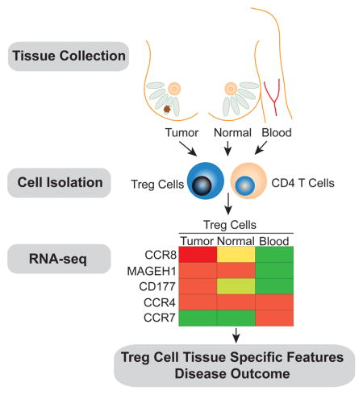
The image above shows an abstraction of the data used in our analysis. RNAseq data were sampled from the patient with breast cancer, including tumor, normal breast parenchyma (NBP) and blood samples. Our study only focuses on the released tumor and NBP samples from the Illumina HiSeq 2500 platform.  

```{r plots, message=FALSE, tidy=TRUE}

# Unpivot dataset
geo_data_normalized_unpivot <- geo_data %>% 
  log2() %>% 
  as.data.frame() %>% 
  tidyr::gather(key=sample, value=log_cpm) %>% subset(log_cpm > 0)

# Density plot before and after nor.
ggplot2::ggplot(geo_data_normalized_unpivot, ggplot2::aes(x=log_cpm, color=sample)) +
  ggplot2::geom_density() + ggplot2::labs(title = "Density by sample after Normalization") + 
  ggplot2::theme(legend.position="none")

# Boxplot before and after nor.
ggplot2::ggplot(geo_data_normalized_unpivot, ggplot2::aes(x=sample, y=log_cpm, color=sample)) + 
  ggplot2::geom_boxplot() + ggplot2::coord_flip() + ggplot2::labs(title = "Boxplot by sample after Normalization") + 
  ggplot2::theme(legend.position="none")


```
In assignment 1, the data were normalized with the TTM workflow. The first plot is a density plot after normalization; it shows an approximately bimodal distribution for our dataset. The second plot is a boxplot of the data by the sample after the normalization; it shows that the data is skewed left. 

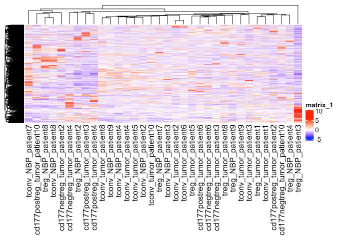

The heatmap shows quite a few gene expression variations between different patients and sample types. Therefore, we process with differential gene expression analysis in assignment 2. 

# Differential gene expression analysis

## Model creation

In assignment 2, we chose to apply edgeR workflow to preform differential expression analysis between each sample_type:

```{r model, warning=FALSE, tidy=TRUE}

# Setup the model attributes for EdgeR
model_design <- model.matrix(~ samples$sample_type)
d <- edgeR::DGEList(counts=geo_data, group=samples$sample_type)
d <- edgeR::estimateDisp(d, model_design)

# Fit QLF model and get result
fit <- edgeR::glmQLFit(d, model_design)
fit.qlf <- edgeR::glmQLFTest(fit, coef='samples$sample_typetumor')

knitr::kable(edgeR::topTags(fit.qlf), type="html",row.names = FALSE, caption = "Fitted with sample type by edgeR")

topfit_byS.qlf <- edgeR::topTags(fit.qlf,sort.by = "PValue",
                           n = nrow(geo_data))

topfit_byS.qlf_sig <- length(which(topfit_byS.qlf$table$PValue < 0.01))
topfit_byS.qlf_sigadj <- length(which(topfit_byS.qlf$table$FDR < 0.05))
```

At the same time, other methods such as the "Limma differential analysis on different sample types" or "Limma differential analysis on sample_type + patient (complex model)" were also considered. Long story short, the edgeR workflow is preferred because of the following reason:
* EdgeR model identifies more genes under significant range while aligning better with the original research. This is shown on the first scatter plot labelled with CCR genes (Limma vs EdgeR by sample type CCR labelled)
* The Limma complex model introduced another layer of information and altered the thresholds list to include lots of genes which is not significantly expressed by looking at their samples alone. This is represented on the second scatter plot below:

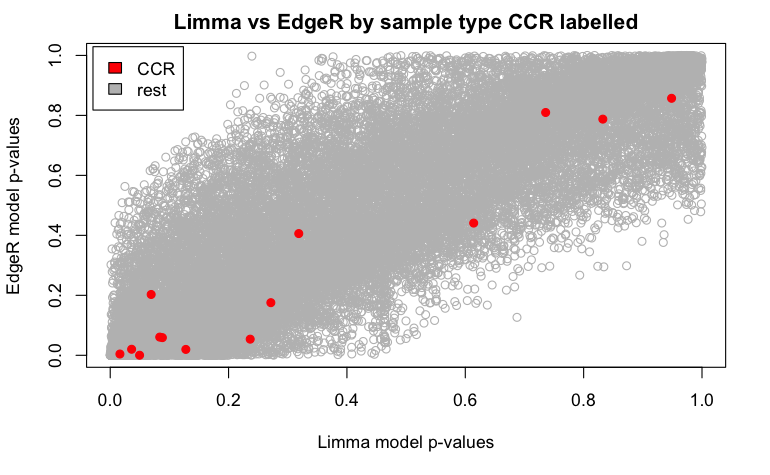

## Model results

```{r MDplot, warning=FALSE, tidy=TRUE}

# Plotting using result from samples_type edgeR 

# Clustering samples by sample type
tumor <- geo_data[, grepl("tumor", colnames(geo_data))]
NBP <- geo_data[, grepl("NBP", colnames(geo_data))]
geo_data_avg <- data.frame(hgnc_symbol = gsub("-", ".", rownames(geo_data)), Tumor = rowMeans(tumor), NBP = rowMeans(NBP))

# Construct the edgeR result table
topfit_byS.qlf.result <- cbind(topfit_byS.qlf$table, hgnc_symbol = rownames(topfit_byS.qlf$table))

# Merge it with the fit result
geo_data_byS <- merge(geo_data_avg, topfit_byS.qlf.result, by.x= "hgnc_symbol", by.y="hgnc_symbol", all=TRUE)

# Count under/over express genes
under_exp <- sum(geo_data_byS$logFC < 0 & geo_data_byS$PValue < 0.01)
over_exp <- sum(geo_data_byS$logFC > 0 & geo_data_byS$PValue < 0.01)

# Prepare coloring on the plots
status <- rep(0, nrow(geo_data_byS))
status[geo_data_byS$logFC < 0 & geo_data_byS$PValue < 0.01] <- -1
status[geo_data_byS$logFC > 0 & geo_data_byS$PValue < 0.01] <- 1

limma::plotMD(log2(geo_data_byS[,c(2,3)]), status=status, values=c(-1,1), hl.col=c("blue","red"), main = "MA plots (signifi labelled with edgeR)")

# ------------------------------------------------------------------------------------------------

# Create function for heatmap crafting
expression_heatmap <- function(diffed_gene){

  # get the expression data of these genes, normalized, ordered
  enrich_heatmap_matrix <- geo_data[row.names(geo_data) %in% diffed_gene,] %>% t() %>% scale() %>% t()
  enrich_heatmap_matrix <- enrich_heatmap_matrix[,
                          c(grep("tumor",colnames(enrich_heatmap_matrix)),
                            grep("NBP",colnames(enrich_heatmap_matrix)))]
  

  # Setup colors
  heatmap_col = circlize::colorRamp2(c(min(enrich_heatmap_matrix), 0, 
                                        max(enrich_heatmap_matrix)), 
                                      c("blue", "white", "red"))
  
  ha_colours <- c("darkgreen","darkblue")
  names(ha_colours) <- c("tumor", "NBP")

  ha <- ComplexHeatmap::HeatmapAnnotation(df=data.frame(
    type = rep(c("tumor", "NBP"), c(22, 12))),col = list(type = ha_colours))
  

  # Create heatmap
  signif_heatmap <- ComplexHeatmap::Heatmap(as.matrix(enrich_heatmap_matrix),
                           cluster_rows = TRUE,
                           cluster_columns = FALSE,
                           show_row_dend = TRUE,
                           show_column_dend = FALSE,
                           col=heatmap_col,
                           show_column_names = TRUE,
                           show_row_names = FALSE,
                           show_heatmap_legend = TRUE,
                           top_annotation = ha, 
                           use_raster = TRUE)
  
  return(signif_heatmap)
}

# Subset the threshold gene
top_hits <- topfit_byS.qlf.result$hgnc_symbol[topfit_byS.qlf.result$PValue < 0.01]
expression_heatmap(top_hits)

```

As shown above, we plotted the MA plot using the result from the edgeR package. Downregulated genes are labelled in blue and unregulated genes are marked in red. There are approximate `r under_exp` downregulated genes and `r over_exp` up regulated genes. Additionally, I also plotted the heatmap plot from the top hit genes and reveal the clustering between tumor and NBP samples. When looking at the samples labelled in dark blue from the left, there is clustering on the lower side of the heatmap, and in the meantime, a significant red clustering exists on the upper side of the tumor samples labelled in dark green.

# Thresholded over-representation analysis

```{r threshold, warning=FALSE, tidy=TRUE}

# Calculate up/down regulated genes
upregulated_genes <- topfit_byS.qlf.result$hgnc_symbol[which(topfit_byS.qlf.result$PValue < 0.01 & 
                            topfit_byS.qlf.result$logFC > 0)]
downregulated_genes <- topfit_byS.qlf.result$hgnc_symbol[which(topfit_byS.qlf.result$PValue < 0.01 & 
                            topfit_byS.qlf.result$logFC < 0)]

# Export gene tables
write.table(x=upregulated_genes,
            file=file.path("data", "mets_upregulated_genes.txt"),sep = "\t",
            row.names = FALSE,col.names = FALSE,quote = FALSE)
write.table(x=downregulated_genes,
            file=file.path("data", "mets_downregulated_genes.txt"),sep = "\t",
            row.names = FALSE,col.names = FALSE,quote = FALSE)

if (!file.exists("./data/Supplementary_Table2_mets_ranked_genelist.rnk")) {
  ranked_genelist <- data.frame(GeneName=topfit_byS.qlf.result$hgnc_symbol, 
             rank=-log(topfit_byS.qlf.result$PValue,base =10) * 
               sign(topfit_byS.qlf.result$logFC))
  ranked_genelist <- ranked_genelist[order(ranked_genelist$rank),]
  write.table(x=ranked_genelist, file=file.path("data", "Supplementary_Table2_mets_ranked_genelist.rnk"),
              col.names = F,row.names = F, quote = F,sep="\t",)
}

```

Lastly, a thresholded over-representation analysis is run. The method I used is the Benjamini-Hochberg FDR method under g:profiler [@gProfiler]. G:profiler is a constantly updating annotation tools, and has connection with many human genome databases. I choose to use the following four annotation data: 
  GO: Biological Process - Release 2020-12-08 [@GO]
  KEGG – Release 2020-12-14 [@KEGG]
  Reactome – Release 2020-12-15 [@Reactome]
  WikiPathways – Release 2020-12-10 [@WP]
Since they are both biological pathway databases with relatively recent updates, it will be helpful to look at results from all of them. Additionally, the original paper uses GO as its source of pathway analysis. [@PlitasDATA]

The result is as followed:

* g:Profiler complete thresholded list detail:
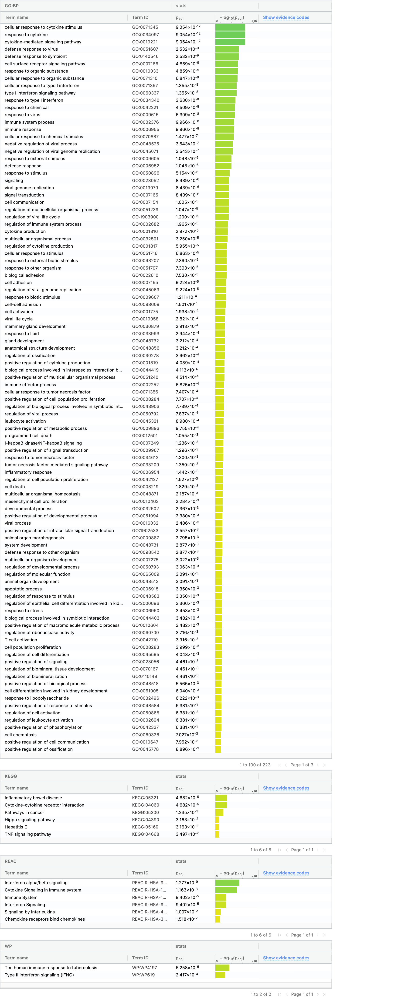
* g:Profiler down regulated list detail:
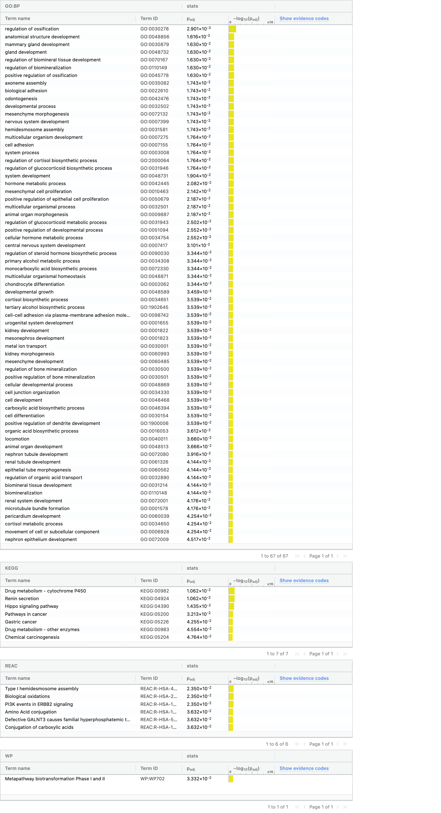
* g:Profiler up regulated list detail:
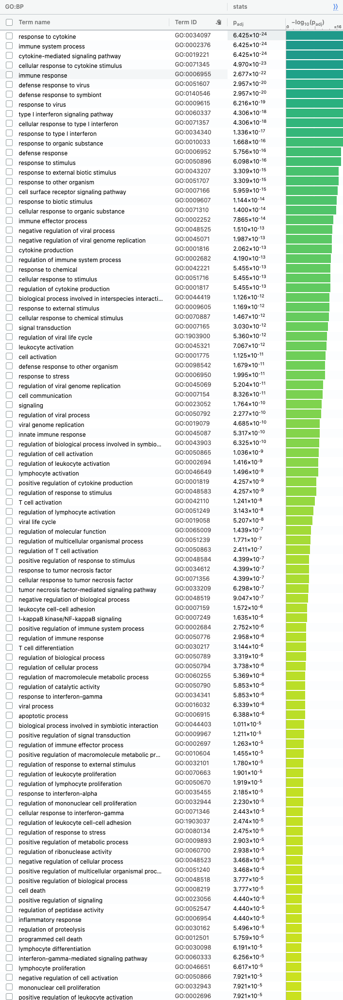
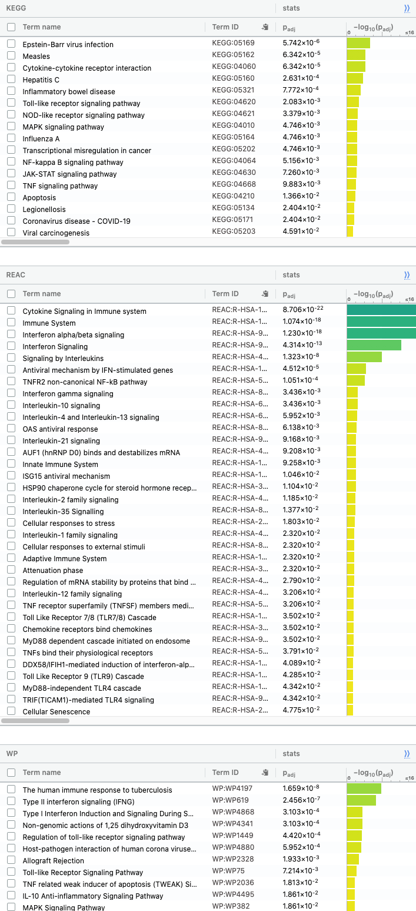

From the result above, it is clear to see that the up regulated gene is more significantly marked by the g:profiler, while the downr egulated genes are not. This finding is echoing with the MA plots for patients, where it shows many "down regulated genes" exist between each patient. These individual variations are primarily due to randomness. Hence it is less likely to be correlated to an exact pathway. The whole list shares similar genesets with the up regulated list, where "cytokine" related genesets are highlighted. 

# Non-thresholded gene set enrichment analysis with GSEA

## Setup enviroment

```{r non-thresholded}

#path to GSEA jar 
gsea_jar <- params$gsea_jar
java_version <- params$java_version

#Gsea takes a long time to run.  If you have already run GSEA manually or previously there is no need to re-run GSEA.  Make sure the 
# gsea results are in the current directory and the notebook will be able to find them and use them.
run_gsea = params$run_gsea

#navigate to the directory where you put the downloaded protocol files.
working_dir <- params$working_dir

analysis_name <- params$analysis_name
rnk_file <- params$rnk_file
expression_file <- params$expression_file
classes_file <- params$classes_file

is_docker <- params$is_docker

if (!file.exists(file.path(working_dir, expression_file))) {
  expression <- cbind(Name = row.names(geo_data), geo_data)
  write.table(expression, file.path(working_dir, expression_file),row.names=FALSE, sep="\t", quote = FALSE)
}

```

## Download the latest pathway definition file

```{r download baderlab gmt file, message=FALSE, warning=FALSE, include=FALSE}
gmt_url = "http://download.baderlab.org/EM_Genesets/current_release/Human/symbol/"

# List all the files on the server
filenames = RCurl::getURL(gmt_url)
tc = textConnection(filenames)
contents = readLines(tc)
close(tc)

# Get the gmt that has all the pathways and does not include terms inferred from electronic annotations(IEA)
rx = gregexpr("(?<=<a href=\")(.*.GOBP_AllPathways_no_GO_iea.*.)(.gmt)(?=\">)",
  contents, perl = TRUE)
gmt_file = unlist(regmatches(contents, rx))

dest_gmt_file <- file.path(working_dir, paste("Supplementary_Table3_",gmt_file,sep="") )

download.file(
    paste(gmt_url,gmt_file,sep=""),
    destfile=dest_gmt_file
)
```

## Run GSEA

```{r run_GSEA}

# Search gsea result file in the repo
gsea_directories <- list.files(path = working_dir, pattern = "\\.GseaPreranked")

# If gsea has not been run
if(length(gsea_directories) == 0){
  
  if(!file.exists(gsea_jar)){
    gsea_jar <- "/home/rstudio/GSEA_4.1.0/gsea-cli.sh"
  }
  
  # Use the command script
  if(run_gsea && java_version == "11"){
    command <- paste("",gsea_jar,  "GSEAPreRanked -gmx", dest_gmt_file, "-rnk" ,file.path(working_dir,rnk_file), "-collapse false -nperm 1000 -scoring_scheme weighted -rpt_label ",analysis_name,"  -plot_top_x 20 -rnd_seed 12345  -set_max 200 -set_min 15 -zip_report false -out" ,working_dir, " > gsea_output.txt",sep=" ")
    system(command)
  } else if (run_gsea) {
    command <- paste("java  -Xmx1G -cp",gsea_jar,  "xtools.gsea.GseaPreranked -gmx", dest_gmt_file, "-rnk" ,file.path(working_dir,rnk_file), "-collapse false -nperm 1000 -permute gene_set -scoring_scheme weighted -rpt_label ",analysis_name,"  -num 100 -plot_top_x 20 -rnd_seed 12345  -set_max 200 -set_min 15 -zip_report false -out" ,working_dir, "-gui false > gsea_output.txt",sep=" ")
    system(command)
  }

  # Search gsea result file in the repo
  gsea_directories <- list.files(path = working_dir, pattern = "\\.GseaPreranked")

  #get the details on the files
  details = file.info(file.path(getwd(),working_dir,gsea_directories))
  #order according to newest to oldest
  details = details[with(details, order(as.POSIXct(mtime),decreasing = TRUE)), ]

  #use the newest file:
  gsea_output_dir <- row.names(details)[1]
} else {
  gsea_output_dir <- gsea_directories
}
```

#### What method did you use? What genesets did you use? Make sure to specify versions and cite your methods.

The method used is the GSEA pre-ranked algorithm [@GSEA], command-line version 4.1.0. The genesets used is the human GOBP file with all the pathways and does not include terms inferred from electronic annotations(IEA) from the Bader lab, which lasted updated 03/01/2021 [@GeneSet]. GSEA is set to run with gene sets of size 15 ~ 200.

#### Summarize your enrichment results.
```{r gsea_result}

gsea_report_table <- list.files(path = file.path(working_dir,gsea_output_dir), pattern = "gsea_report.*\\.tsv$")
gsea_report_for_neg <- read.delim(file.path(working_dir,gsea_output_dir, gsea_report_table[grep("neg", gsea_report_table)]), stringsAsFactors = F)
gsea_report_for_pos <- read.delim(file.path(working_dir,gsea_output_dir, gsea_report_table[grep("pos", gsea_report_table)]), stringsAsFactors = F)

knitr::kable(gsea_report_for_neg[1:10,c(1,4:8)], "html", caption = "Top Down Regulated Enrichment Analysis Result")
knitr::kable(gsea_report_for_pos[1:10,c(1,4:8)], "html", caption = "Top Up Regulated Enrichment Analysis Result")

```

In the up regulated gene sets:

* 3101 / 5825 gene sets are up regulated in tumor samples
* 1642 gene sets are significant at FDR < 25%
* 846 gene sets are significantly enriched at nominal pvalue < 1%
* 1252 gene sets are significantly enriched at nominal pvalue < 5%

As for the down regulated gene sets:

* 2724 / 5825 gene sets are downregulated in tumor samples
* 359 gene sets are significantly enriched at FDR < 25%
* 210 gene sets are significantly enriched at nominal pvalue < 1%
* 468 gene sets are significantly enriched at nominal pvalue < 5%

#### How do these results compare to the results from the thresholded analysis in Assignment #2. Compare qualitatively. Is this a straight forward comparison? Why or why not?

g:Profiler downregulated list detail result:

g:Profiler up regulated list detail result: 


The GSEA result is similar to the threshold list result ran by gProfiler [@gProfiler], where lots of up regulated gene sets were shown as significant. In contrast, the down regulated gene sets are relatively insignificant. However, there are differences between the gene sets identified in gProfiler and GSEA. For down-regulated gene sets, the pathway identified in the GSEA is specific to membrane-related pathway, while gene sets identified by gProfiler are mostly cell proliferation-related. Similarly, for the up-regulated gene sets, the GSEA result is dominated by the type 1 interferon-related pathway, where gProfiler results mostly from immune response and cytokine signalling pathway. It is also discovered that the output from GSEA is heavily clustered compared to the gProfiler result. 

I think it is a straightforward comparison for examining results between GSEA and gProfiler. First of all, the threshold list used in gProfiler is a subset of the ranked gene list used in GSEA. Additionally, Benjamini-Hochberg FDR method is used in the selection of gene sets in both analyses. The resulting pathway should show certain degrees of similarity and should be directly comparable. 

# Visualize Gene set Enrichment Analysis in Cytoscape

## Setup enviroment

```{r create_enrichment_map_params, eval=F}

# The code chunk is only used for setting up the Cytoscape environment
# No image is complied on the fly ###################################

pvalue_gsea_threshold <- params$pval_thresh
qvalue_gsea_threshold <- params$fdr_thresh

similarity_threshold <- "0.375"
similarity_metric = "COMBINED"

cur_model_name <- analysis_name

gsea_results_path <- file.path(gsea_output_dir,"edb")
gsea_results_filename <- file.path(gsea_results_path,"results.edb")

# Use orginal gmt file
gmt_gsea_file <- file.path(getwd(),dest_gmt_file)
gsea_ranks_file <- file.path(gsea_results_path,list.files(gsea_results_path,pattern=".rnk"))
expression_file_fullpath <- file.path(getwd(),working_dir,expression_file)

#if using docker we need to replace all the the paths to the host path
if(is_docker) {
  upload_em_file <- function(localPath) {
    bname <- basename(localPath)
    r <- POST(
      url = paste('http://localhost:1234/enrichmentmap/textfileupload?fileName=', bname, sep=""),
      config = list(),
      body = list(file = upload_file(localPath)),
      encode = "multipart",
      handle = NULL
    )
    content(r,"parsed")$path
  }
  
  # "upload" the files to the host machine and replace each path with the host machine path
  expression_file_fullpath <- upload_em_file(expression_file_fullpath)
  gmt_gsea_file <- upload_em_file(gmt_gsea_file)
  gsea_ranks_file <- upload_em_file(gsea_ranks_file)
  gsea_results_filename <- upload_em_file(gsea_results_filename)
}

current_network_name <- paste(cur_model_name,pvalue_gsea_threshold,qvalue_gsea_threshold,sep="_")

em_command = paste('enrichmentmap build analysisType="gsea" gmtFile=',gmt_gsea_file,
                   'pvalue=',pvalue_gsea_threshold, 'qvalue=',qvalue_gsea_threshold,
                   'similaritycutoff=',similarity_threshold,
                   'coefficients=',similarity_metric,
                   'ranksDataset1=', gsea_ranks_file,
                   'enrichmentsDataset1=',gsea_results_filename, 
                   'expressionDataset1=',expression_file_fullpath,
                   'filterByExpressions=false',
                   'gmtFile=',gmt_gsea_file,
                   sep=" ")

#response <- RCy3::commandsGET(em_command)
```

#### Create an enrichment map - how many nodes and how many edges in the resulting map? What thresholds were used to create this map? 

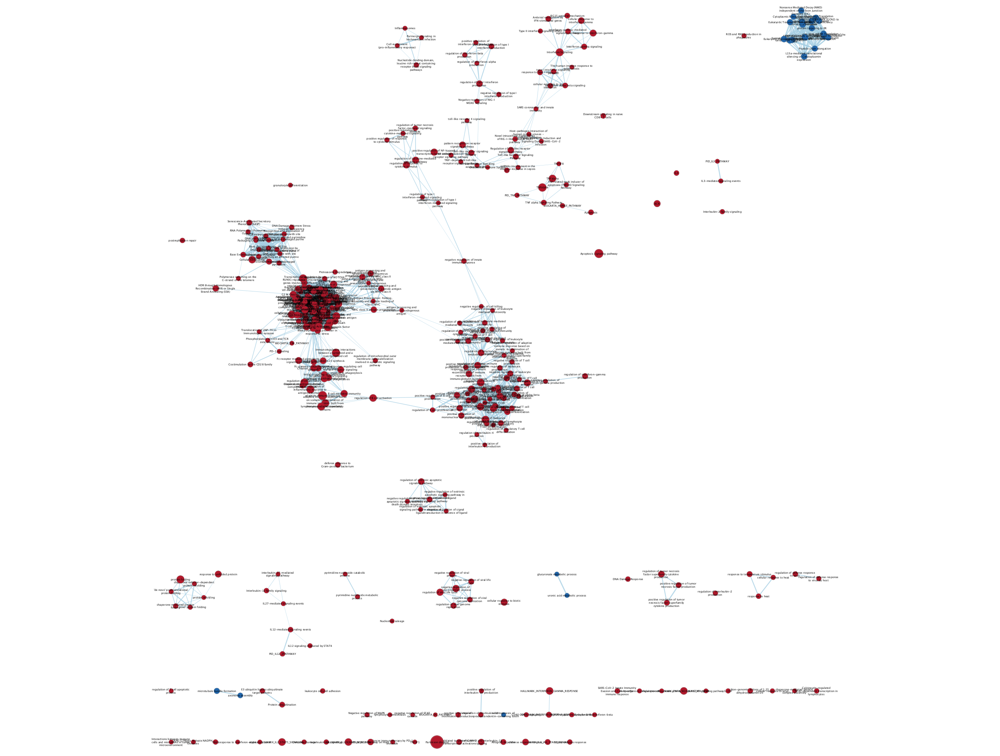
There are in total 424 nodes and 5320 edges in the resulting map. For the nodes selection, FDR q-value cutoff was 0.01, and p-value cutoff was 1.0, the edge cutoff is set to 0.375, NES was set to "All," and similarity metric is set to combine. Additionally, the GMT file used is the original copy from the Bader lab, instead of the filtered list from GSEA. Styling and label are set to default. The enrichment map is generated using the Enrichment Map app [@EnrichmentMap] from Cytoscape [@Cytoscape].

#### Network Annotation - what parameters are used to annotate the network

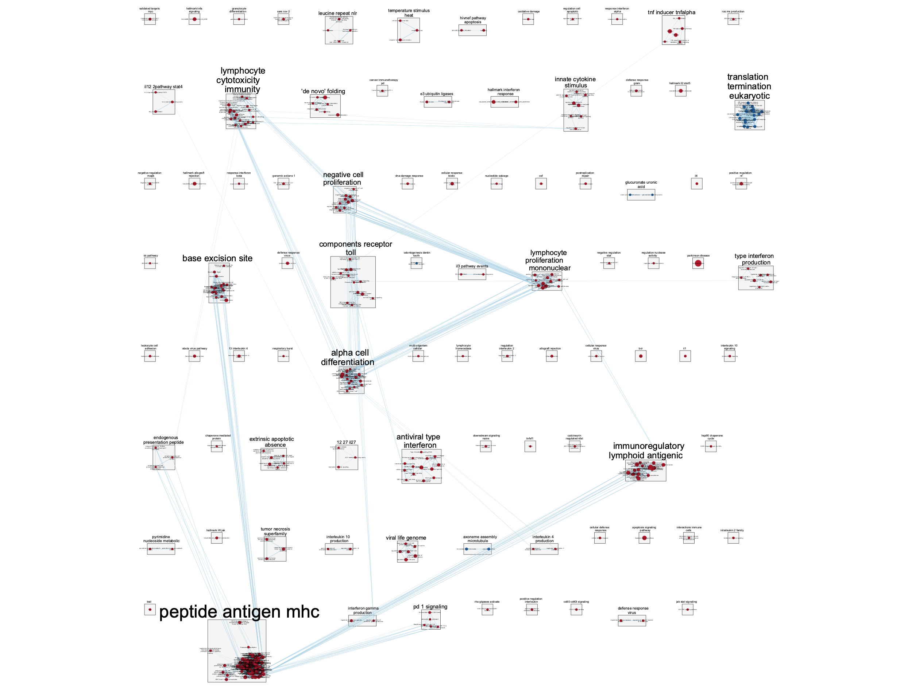
The annotation is generated using the Auto Annotate app [@AutoAnnotate] from Cytoscape. The annotation is set to annotate the entire network, with "layout network to prevent cluster overlap." Additionally, the cluster is identified using the cluster maker app with the MCL cluster algorithm, calculated with the similarity_coefficient, GS_DESCR is used as cluster annotation. Finally, the image is re-organized into a matrix form for better presentation; the cluster's fill colour is set to light grey while the shape is set to box. 

#### Publication ready figure

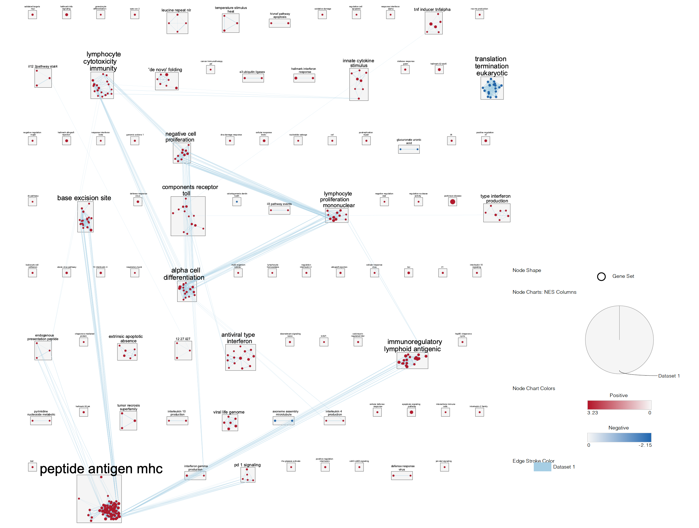
The publication ready network is shown above. 

#### Collapsed theme network - What are the major themes present in this analysis? Do they fit with the model? Are there any novel pathways or themes?

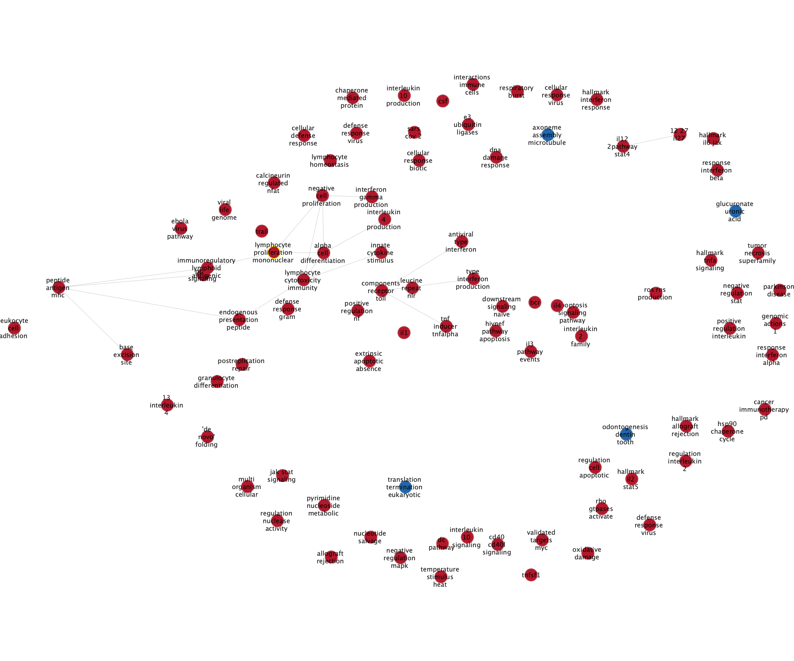
```{r cluster_map}

# Read node table
cluster_node_table <- read.csv(file.path(working_dir, "Cluster_Map_Node.csv"), header = T, stringsAsFactors = F)
cluster_node_table <- cluster_node_table[order(cluster_node_table$cluster.node.count, decreasing = T),]
knitr::kable(cluster_node_table[1:10,c("name", "cluster.node.count", "EnrichmentMap..NES..Dataset.1.")], "html", 
             caption = "Top clustered nodes", row.names = F, 
             col.names = c("Cluster name", "Cluster node count", "NES"))

```

The collapsed theme network is shown above. The most clustered node and major themes are listed in the table above. These themes fit with the model, as the peptide antigen pathway's principal function is to present antigen to T cells to discriminate between self and the invaders. It is associated with immune reactions. Overall it does align with the model. The following theme is also similar to the result from GSEA and gprofiler, as discussed earlier. 

However, novel pathways exist; for example, there is the up regulation of "base excision site," which is not discussed in the original paper.A review article on DNA damage response (DDR) states that DDR activities regulate genome replication; it is up regulated in the tumor breast cancer cell. In the meantime, "DNA damage results in an increase in levels of inflammatory cytokines, which activate type I interferons which are known to augment cytotoxic T-cell priming." [@MinchomDDR] The upregulation of genes associated with genome replication in Treg may be coming from the tumor cell in the form of contamination.  

#### Do the enrichment results support conclusions or mechanism discussed in the original paper? How do these results differ from the results you got from Assignment #2 thresholded methods

The original paper conducted GO pathway enrichment analysis; the mechanism and databases used are similar to the one we used in our analysis. However, the result from our enrichment analysis deviates from the original paper where it listed "several cytokine and chemokine receptor genes, most notably CCR8, were up regulated in tumor-resident Treg cells in comparison to normal tissue-resident ones." [@PlitasDATA]. In the GSEA result, the "cytokine" related signalling pathway and response pathway are ranked below the top 50 pathways. Nevertheless, in the clustered network analysis, the cytokine-related theme is also absent, up regulated "innate cytokine stimulus" ranked 19 in from the FDR sorted list. This results from the extra genes absent from the threshold list, which enriched the enrichment score. As a result, the cytokine-related pathway is less noticeable from the enrichment result.

On the other hand, the results from the threshold method align with the output from the original paper. However, the CCR8 gene is highlighted in the original paper, but it is not part of our thresholded list. This could be because of differences in choosing significant levels (the original article decide to use a = 0.05) and differences in gene mappings. The mapping list is slightly different in 2021 compared to 2017 when the paper was initially published. Other pathways identified, such as "Type 1 IFNs" and "DNA damage response (DDR)," are identified by both enrichment analysis and the thresholded analysis, as discussed in the GSEA result. 

#### Can you find evidence, i.e. publications, to support some of the results that you see. How does this evidence support your result?

The result from the GSEA is similar to the result from gProfiler,

One of the results I found is that the immune response and Type 1 IFNs pathway are up regulated in the tumor cells. This is seen in another study proposing the mechanism through which BRCA1 regulates IFN-γ–dependent signalling, which induces the up regulation. [@BuckleyIFN] This could affect the downstream pathway in the tumor-residents Treg cell, therefore showing up regulation of type 1 IFNs pathway in our tumor samples. 

Another result I found is the regulation of genome replication. A review article on DNA damage response (DDR) states that DDR activities regulate genome replication; it is up regulated in the tumor breast cancer cell. In the meantime, "DNA damage results in an increase in levels of inflammatory cytokines, which activate type I interferons which are known to augment cytotoxic T-cell priming." [@MinchomDDR] The upregulation of genes associated with genome replication in Treg may be coming from the tumor cell in the form of contamination.  

# Dark matter analysis 

## Setup enviroment

```{r dark_matter_setup}

# Load the geneset file
capture.output(genesets <- GSA::GSA.read.gmt(dest_gmt_file), file = "gsa_loud.out")
names(genesets$genesets) <- genesets$geneset.names
genes_all_gs <- unique(unlist(genesets$genesets)) 

# Load the expression data
expression <- readRDS("GEO_data_cleaned.rds")

# Load genes from enriched pathway 
all_enr_genesets <- c(gsea_report_for_neg$NAME, gsea_report_for_pos$NAME) 

genes_enr_gs <- c()
for(i in 1:length(all_enr_genesets)){
  current_geneset <- unlist(genesets$genesets[which(genesets$geneset.names %in% all_enr_genesets[i])])
  genes_enr_gs <- union(genes_enr_gs, current_geneset)
}

# Load genes from significant enriched pathway 
FDR_threshold <- 0.001

all_enr_genesets_sig <- c(gsea_report_for_neg[which(gsea_report_for_neg$FDR.q.val < FDR_threshold),]$NAME, 
                      gsea_report_for_pos[which(gsea_report_for_pos$FDR.q.val < FDR_threshold),]$NAME) 

genes_enr_gs_sig <- c()
for(i in 1:length(all_enr_genesets_sig)){
  current_geneset <- unlist(genesets$genesets[which(genesets$geneset.names %in% all_enr_genesets_sig[i])])
  genes_enr_gs_sig <- union(genes_enr_gs_sig, current_geneset)
}

```

## Constructe venn diagram

```{r calculate_darkmatter}

# Constructe venn diagram
A <- genes_all_gs %>% na.omit()
B <- genes_enr_gs_sig %>% na.omit()
C <- expression %>% row.names()

venn_diagram_path <- file.path(getwd(),"image","dark_matter_overlaps_sig.png")

# Draw venn diagram
if (!file.exists(venn_diagram_path)){
  png(venn_diagram_path)
  VennDiagram::draw.triple.venn(area1 = length(A), area2 = length(B), area3 = length(C), 
                                n12 = length(intersect(A, B)), n13 = length(intersect(A, C)), 
                                n23 = length(intersect(B, C)), n123 = length(intersect(A, intersect(B, C))), 
                                category = c("all genesets", "all enrichment results", "all expressed data"), 
                                fill = c("red", "green", "blue"), 
                                cat.col = c("red", "green", "blue"))
  dev.off()
}

# Find annotation result
genes_no_annotation <- setdiff(C, A)
genes_no_enrichment <- setdiff(C, B)

# Read rank file
ranks <- read.table(file.path(working_dir,rnk_file), sep = "\t", stringsAsFactors = F)
colnames(ranks) <- c("gene", "rank")
ranked_gene_no_annotation <- ranks[which(ranks[,1] %in% genes_no_annotation),]
ranked_gene_no_annotation <- ranked_gene_no_annotation[order(ranked_gene_no_annotation$rank, decreasing = T), ]

ranked_gene_no_enrichment <- ranks[which(ranks[,1] %in% genes_no_enrichment),]
ranked_gene_no_enrichment <- ranked_gene_no_enrichment[order(ranked_gene_no_enrichment$rank, decreasing = T), ]

knitr::kable(ranked_gene_no_annotation[1:10,], "html", caption = "Ranked gene without annotation", row.names = FALSE)
knitr::kable(ranked_gene_no_enrichment[1:10,], "html", caption = "Ranked gene excluded from enrichment analysis", row.names = FALSE)
```

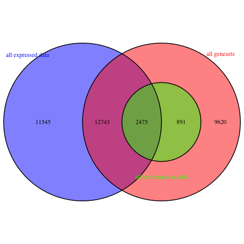
From the graphic above, we can see that the dark matter portion of our analysis is quite large. There are 11545 genes absent from the GMT file, the up regulated among these is "EML2-AS1," which has a rank of 6.365250. The gene without annotation such as "EML2-AS1" and "BHLHE40-AS1" are antisense RNAs or non-coding RNAs [@NCBI]. Therefore, it is excluded in the gene sets. 

Moreover, there are 24288 genes absent from the enrichment analysis. Surprisingly, the top regulated gene such as "TYMP" and "ETV7" are transcription factors [@TYMP] and antigens [@ETV7]. These ought to play a role in cellular activity. Still, it is excluded from the enrichment result. We will look at their effect on the following section:

## Visualization of the Dark Matter with Heatmaps

Here we constructed the heatmap of any significant genes that are not annotated to any of the pathways returned in the enrichment analysis and a heatmap of any significant genes that are not annotated to any pathways in the entire set of pathways used for the analysis.

```{r heatmaps_dark_matter, eval=F}

# pre rendered for quicker presentation
expression_heatmap(ranked_gene_no_annotation$gene) 
expression_heatmap(ranked_gene_no_enrichment$gene)

```
Ranked gene with no annotation heatmap:
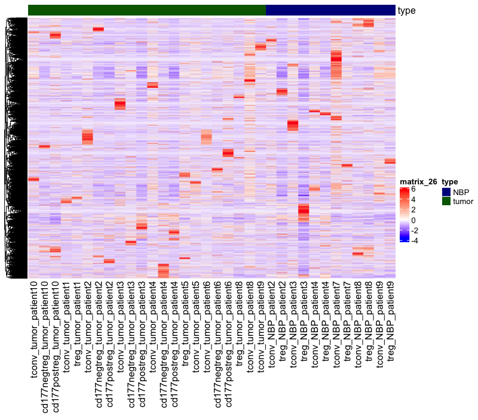

Ranked gene with no enrichment heatmap:
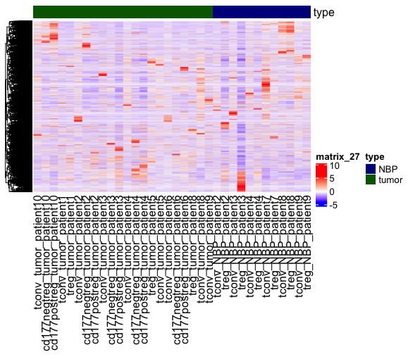

In both heatmaps presented above, there is no clear clustering of the gene between the tumor sample, NBP samples, or each patient. Therefore, it is fair to say that the dark matter portion of the data is random to a certain degree and has a limited effect on the enrichment analysis. 

# Reference
